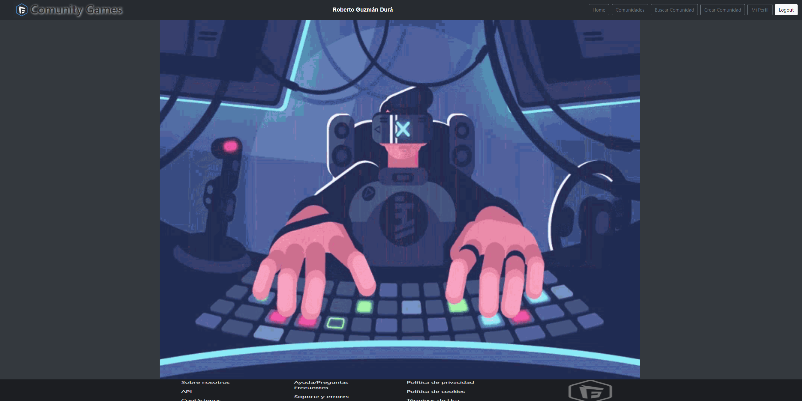
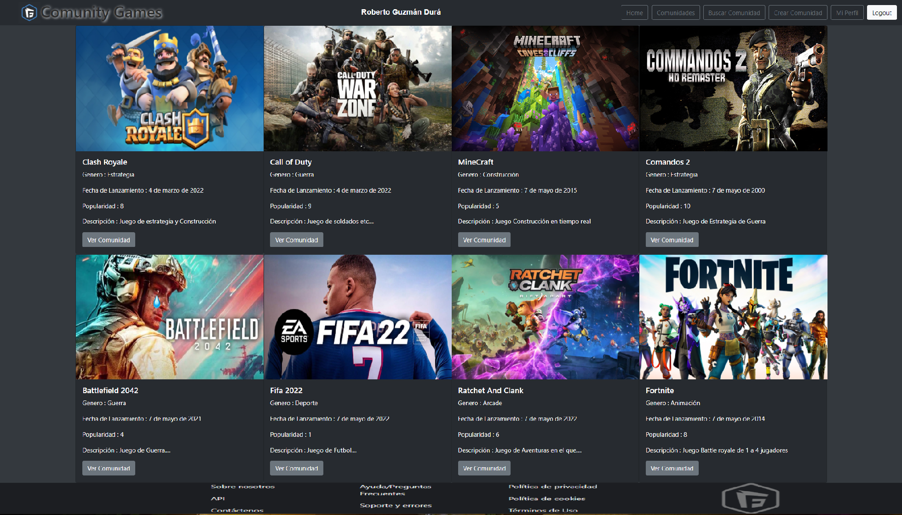
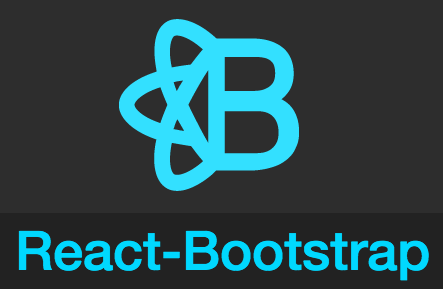

# Comunity Games API Frontend
***

***
## Repositorio en el que se a estado trabajando el proyecto. 
## https://github.com/RobertoGuzman64/comunitygamesfrontend.git
***

***

La aplicación tiene las siguientes características:
* Los usuarios pueden logearse en la aplicación. Existen 2 tipos de usuarios, y cada perfil podrá realizar una serie de acciones:
    * Perfil Usuario:
        * Buscar Comunidades por Género.
        * Unirse a Comunidades.
        * Abandonar Comunidades.
        * Enviar Mensajes a los chats de las Comunidades.
        * Ver su perfil.
        * Modificar el perfil y la Contraseña.
        * Borrar su cuenta.
    * Perfil Administrador:
        * Crear Comunidades.
        * Borrar Comunidades.
        * Modificar Comunidades.

***

***


## Pre-requisitos del proyecto para hacerlo funcionar en tu equipo local:

* Instalar **Nodejs** en nuestro equipo, descargándolo de su página oficial
https://nodejs.org/

* Clonar el proyecto en nuestro equipo con git bash:
```
git clone 'url-del-repositorio'
```

* Instalar todas las dependecias con el siguiente comando:
```
npm install
```

* Arrancamos el servidor con el siguiente comando:
```
npm start
```

## Tecnologías utilizadas en el proyecto:

* **react**: Instalamos react en nuestro proyecto:
```
npm install react
```
* **react-router-dom**: Instalamos react-router-dom en nuestro proyecto, para poder alternar entre vistas en nuestra aplicación:
```
npm install react-router-dom
```
* **axios**: Instalamos axios en nuestro proyecto, para poder hacer consultas a la API:
```
npm install axios
```
* **redux**: Instalamos redux en nuestro proyecto, para poder usar redux (centralización del estado):
```
npm install redux
```
* **react-redux**: Instalamos react-redux en nuestro proyecto (relaciona react y redux):
```
npm install react-redux
```
* **redux-localstorage-simple**: Instalamos redux-localstorage-simple en nuestro proyecto (guarda el estado en el localStorage):
```
npm install redux-localstorage-simple
```
* **react-icons**: Instalamos react-icons en nuestro proyecto (Librería de iconos de react):
```
npm install react-icons
```
* **moment**: Instalamos moment en nuestro proyecto (Para usar fechas actuales):
```
npm install moment
```
* **react-boostrap**: Instalamos react-boostrap en nuestro proyecto (Librería de componentes de Boostrap):
```
npm install react-boostrap
```
***

***

## Explicación de la estructura del proyecto

El directorio **src** es donde está almacenada toda la aplicación. En este directorio se encuentra lo siguiente:

* **index.js**: Este es el archivo principal. Desde aquí se llama a **<App/>**, que es donde se ejecutará toda la aplicación.

* **app.js**: En este archivo es donde se gestionan los diferentes **Containers** de la aplicación (vistas).

* **Redux**: En este directorio guardamos toda la configuración de redux de la aplicación.
    * **store.js**: En este archivo se encuentra el estado general de la aplicación.
    * **actions**: En este archivo se encuentran los nombres de los tipos de acciones que pasamos por actions a los reducer.
      * **comunidad.actions.js**: En este archivo se encuentran las exportaciones de las acciones que se ejecutarán cuando se haga una petición de DATOS_COMUNIDAD, GENERO_COMUNIDAD, ESTADO_INICIAL al reducer.
      * **index.js**: En este archivo se encuentran las exportaciones de todos los actions.
      * **login.actions.js**: En este archivo se encuentran las exportaciones de las acciones que se ejecutarán cuando se haga una petición de LOGIN, LOGOUT, MODIFICAR_CREDENCIALES del reducer.
      * **miembro.actions.js**: En este archivo se encuentran las exportaciones de las acciones que se ejecutarán cuando se haga una petición de DATOS_MIEMBRO, MIEMBROS_COMUNIDAD al reducer.
    * **reducers**: En este directorio se encuentran todos los reducers que modifican el estado:
        * **datosComunidad.reducer.js**: En este archivo se encuentran los reducer que modifican el estado de las Comunidades.
        * **datosLogin.reducer.js**: En este archivo se encuentran los reducer que modifican el estado de los Usuarios.
        * **datosMiembro.reducer.js**: En este archivo se encuentran los reducer que modifican el estado de los Miembros.
        * **index.js**: En este archivo combinamos todos los reducers, para conseguir la centralización deseada de estados con redux.

* **Containers**: En este directorio es donde se guardarán las diferentes vistas:
    * **Home**: En esta vista tenemos la primera toma de contacto con la aplicación.
    * **Login**: En esta vista tenemos la posibilidad de loguearse o poder redirigir a registro.
    * **Registro**: En esta vista tenemos la posibilidad de introducir los datos para hacer el registro en la app.
    * **Perfil**: En esta vista se muestran los datos del usuario logeado.
    * **EditarPerfil**: En esta vista se pueden modificar los datos del usuario logeado.
    * **EditarClave**: En esta vista se pueden modificar la clave del usuario logeado.
    * **BorrarUsuario**: En esta vista se encuentra el botón de eliminar el usuario y la advertencia.
    * **Comunidades**: En esta vista se visualizan todas las Comunidades y además te redirige para poder unirte a ellas.
    * **Buscar**: En esta vista se puede buscar Comunidades por género y además te redirige para poder unirte a ella.
    * **Comunidad**: En esta vista se visualiza la Comunidad y los miembros unidos a ella, además te redirige para poder unirte a ella o al chat.
    * **CrearComunidad**: En esta vista se puede crear una Comunidad.
    * **EditarComunidad**: En esta vista se puede modificar una Comunidad.
    * **BorrarComunidad**: En esta vista se puede borrar una Comunidad.
    * **Miembro**: En esta vista se encuentra el boton de unirse a la comunidad seleccionada previamente.
    * **Chat**: En esta vista se encuentra el chat de la comunidad seleccionada.
* **Components**: En este directorio es donde se guardan todos los componentes que se usarán en todas las vistas:
    * **Header**: En este componente se encuentra el header de la aplicación además de los botones de navegación.
    * **Footer**: En este componente se encuentra el footer de la aplicación.
* **img**: En este directorio se guardan todas las imágenes que se usarán para la aplicación y para el readme.
***

***